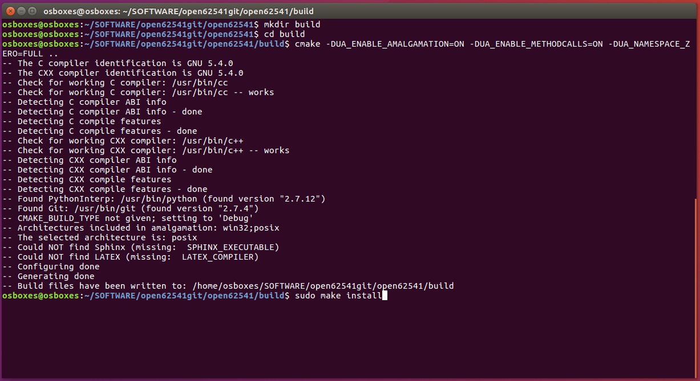
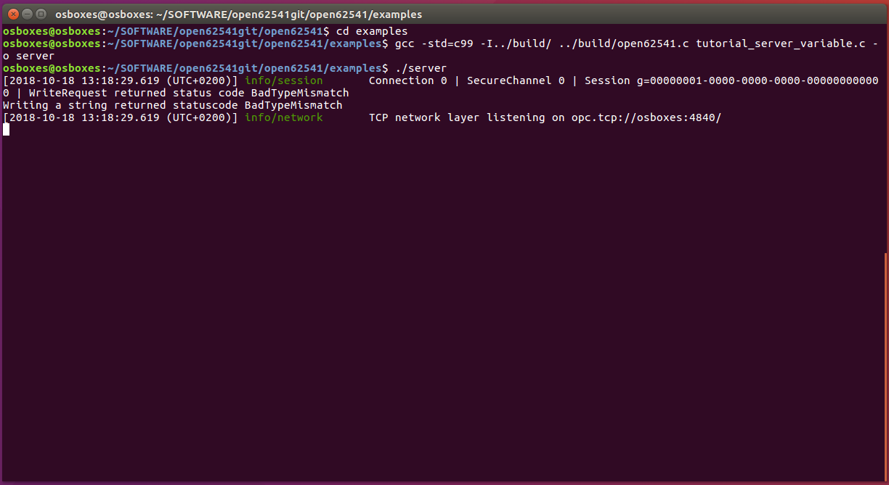
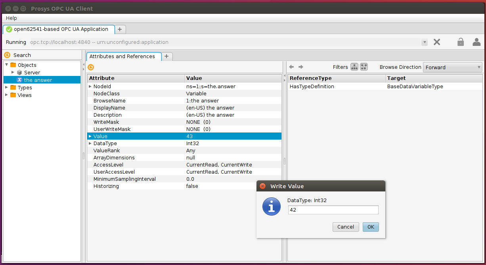

# Getting started with open62541 library


#### Arranging prerequisites
```sh
$ sudo apt-get install git build-essential gcc pkg-config cmake python python-six
```
#### Cloning open62541
```sh
$ git clone https://github.com/open62541/open62541.git
$ cd open62541
$ git submodule init
$ git submodule update
```


#### Building open62541
```sh
$ mkdir build
$ cd build
$ cmake -DUA_ENABLE_AMALGAMATION=ON -DUA_ENABLE_METHODCALLS=ON -DUA_NAMESPACE_ZERO=FULL ..
$ sudo make install
```

#### Building and running OPCUA examples using single-file release open62541.h
```sh
$ cd examples
$ gcc -std=c99 -I../build/ ../build/open62541.c tutorial_server_variable.c -o server
$ ./server
```
 

#### Open a Prosys OPC UA client to view/edit server nodes
**Address**: opc.tcp://<*IP address of server* / *localhost*>:4840



# Making a simple server using Open62541 XmlCompiler
## Step 1: Encoding server namespace in XML
## Step 2: Compiling server namespace XML to generate cpp gen-code
## Step 3: Device driver models
## Step 4: Configuring generate code for a particular device driver model
## Step 5: Writing the device controller code
## Step 6: Compiling and running the server
## Step 7: Observing server behaviour using any OPC-UA client and server's HTML View
