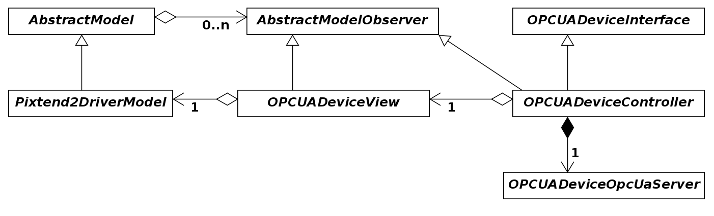
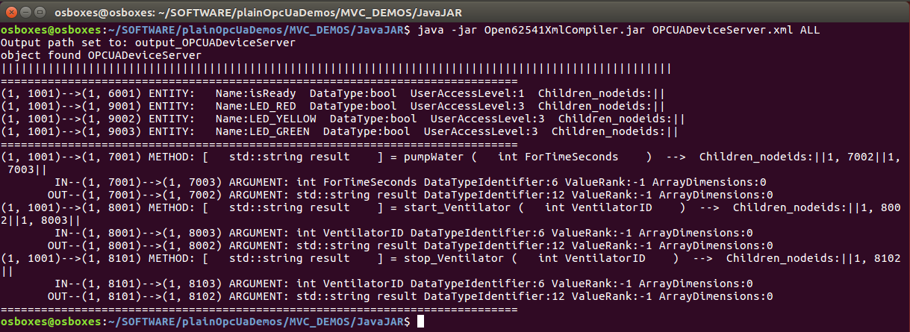

# Making a simple server using Open62541 XML Compiler

An OPC-UA information model can be encoded according to OPC-UA nodeset schema (Link: <https://opcfoundation.org/UA/schemas/1.04/>). When writing a new OPC-UA server, its information model can be encoded in XML format manually or by using a modeling tool. Once encoded, the XML file containing the server's nodeset schema can be compiled using SeRoNet's XML Nodeset Compiler to generate cpp code for a model-view-controller (MVC). By attaching an appropriate device driver model and by implementing the device controller, the OPC-UA server can be completed. Following is an example explaining the MVC architecture for a conveyor belt device running an OPC-UA server.




Following is an information model for a server. 
```
OPCUADeviceServer
|--isReady        	(Boolean    ReadOnly)
|--pumpWater        	(Method	    Input:Time in seconds Output:result code)
|--start_Ventilator     (Method     Input:VentilatorID    Output:result code)
|--start_Ventilator     (Method     Input:VentilatorID    Output:result code)
|--LED_RED        	(Boolean    Read/Write)
|--LED_YELLOW       	(Boolean    Read/Write)
|--LED_GREEN        	(Boolean    Read/Write)
```
Following is a step-by-step walkthrough for generating an OPC-UA server from a given information model. 

## Step 1: Encoding server nodeset

The information model for OPCUADeviceServer can be encoded according to OPC-UA nodeset schema to generate the following XML file.
```
OPCUADeviceServer.xml
```

<details><summary>View File Content</summary>
<p>
	
```XML
<UANodeSet xmlns:xsi="http://www.w3.org/2001/XMLSchema-instance"
           xmlns:uax="http://opcfoundation.org/UA/2008/02/Types.xsd"
           xmlns="http://opcfoundation.org/UA/2011/03/UANodeSet.xsd"
           xmlns:s1="http://yourorganisation.org/example_nodeset/"
           xmlns:xsd="http://www.w3.org/2001/XMLSchema">
    <NamespaceUris>
	<Uri>http://http://opcfoundation.org/UA/SeRoNetOPCUADeviceServer/</Uri>
    </NamespaceUris>
    <Aliases>
        <Alias Alias="Boolean">i=1</Alias>
        <Alias Alias="UInt32">i=7</Alias>
        <Alias Alias="String">i=12</Alias>
        <Alias Alias="HasModellingRule">i=37</Alias>
        <Alias Alias="HasTypeDefinition">i=40</Alias>
        <Alias Alias="HasSubtype">i=45</Alias>
        <Alias Alias="HasProperty">i=46</Alias>
        <Alias Alias="HasComponent">i=47</Alias>
        <Alias Alias="Argument">i=296</Alias>
    </Aliases>
    <Extensions>
        <Extension>
            <ModelInfo Tool="UaModeler" Hash="Zs8w1AQI71W8P/GOk3k/xQ=="
                       Version="1.3.4"/>
        </Extension>
    </Extensions>
    <UAReferenceType NodeId="ns=1;i=4001" BrowseName="1:providesInputTo">
        <DisplayName>providesInputTo</DisplayName>
        <References>
            <Reference ReferenceType="HasSubtype" IsForward="false">
                i=33
            </Reference>
        </References>
        <InverseName Locale="en-US">inputProcidedBy</InverseName>
    </UAReferenceType>
    <UAObjectType IsAbstract="true" NodeId="ns=1;i=1001"
                  BrowseName="1:OPCUADeviceServer">
        <DisplayName>OPCUADeviceServer</DisplayName>
        <References>
            <Reference ReferenceType="HasSubtype" IsForward="false">
                i=58
            </Reference>
            <Reference ReferenceType="HasComponent">ns=1;i=6001</Reference>
            <Reference ReferenceType="HasComponent">ns=1;i=7001</Reference>
            <Reference ReferenceType="HasComponent">ns=1;i=8001</Reference>
            <Reference ReferenceType="HasComponent">ns=1;i=8101</Reference>
            <Reference ReferenceType="HasComponent">ns=1;i=9001</Reference>
            <Reference ReferenceType="HasComponent">ns=1;i=9002</Reference>
            <Reference ReferenceType="HasComponent">ns=1;i=9003</Reference>
        </References>
    </UAObjectType>
    <UAVariable DataType="Boolean" ParentNodeId="ns=1;i=1001"
                NodeId="ns=1;i=6001" BrowseName="1:isReady"
                UserAccessLevel="1" AccessLevel="1">
        <DisplayName>isReady</DisplayName>
        <References>
            <Reference ReferenceType="HasTypeDefinition">i=63</Reference>
            <Reference ReferenceType="HasModellingRule">i=78</Reference>
            <Reference ReferenceType="HasComponent" IsForward="false">
                ns=1;i=1001
            </Reference>
        </References>
    </UAVariable>

    <UAMethod ParentNodeId="ns=1;i=1001" NodeId="ns=1;i=7001"
              BrowseName="1:pumpWater">
        <DisplayName>pumpWater</DisplayName>
        <References>
            <Reference ReferenceType="HasModellingRule">i=78</Reference>
            <Reference ReferenceType="HasProperty">ns=1;i=7002</Reference>
            <Reference ReferenceType="HasProperty">ns=1;i=7003</Reference>
            <Reference ReferenceType="HasComponent" IsForward="false">
                ns=1;i=1001
            </Reference>
        </References>
    </UAMethod>
    <UAVariable DataType="Argument" ParentNodeId="ns=1;i=7001" ValueRank="1"
                NodeId="ns=1;i=7002" ArrayDimensions="1"
                BrowseName="OutputArguments">
        <DisplayName>OutputArguments</DisplayName>
        <References>
            <Reference ReferenceType="HasModellingRule">i=78</Reference>
            <Reference ReferenceType="HasProperty"
                       IsForward="false">ns=1;i=7001</Reference>
            <Reference ReferenceType="HasTypeDefinition">i=68</Reference>
        </References>
        <Value>
            <ListOfExtensionObject>
                <ExtensionObject>
                    <TypeId>
                        <Identifier>i=297</Identifier>
                    </TypeId>
                    <Body>
                        <Argument>
                            <Name>result</Name>
                            <DataType>
                                <Identifier>i=12</Identifier>
                            </DataType>
                            <ValueRank>-1</ValueRank>
                            <ArrayDimensions></ArrayDimensions>
                            <Description/>
                        </Argument>
                    </Body>
                </ExtensionObject>
            </ListOfExtensionObject>
        </Value>
    </UAVariable>
    <UAVariable DataType="Argument" ParentNodeId="ns=1;i=7001" ValueRank="1"
                NodeId="ns=1;i=7003" ArrayDimensions="1"
                BrowseName="InputArguments">
        <DisplayName>InputArguments</DisplayName>
        <References>
            <Reference ReferenceType="HasModellingRule">i=78</Reference>
            <Reference ReferenceType="HasProperty"
                       IsForward="false">ns=1;i=7001</Reference>
            <Reference ReferenceType="HasTypeDefinition">i=68</Reference>
        </References>
        <Value>
            <ListOfExtensionObject>
                <ExtensionObject>
                    <TypeId>
                        <Identifier>i=297</Identifier>
                    </TypeId>
                    <Body>
                        <Argument>
                            <Name>ForTimeSeconds</Name>
                            <DataType>
                                <Identifier>i=6</Identifier>
                            </DataType>
                            <ValueRank>-1</ValueRank>
                            <ArrayDimensions></ArrayDimensions>
                            <Description/>
                        </Argument>
                    </Body>
                </ExtensionObject>
            </ListOfExtensionObject>
        </Value>
    </UAVariable>


    <UAMethod ParentNodeId="ns=1;i=1001" NodeId="ns=1;i=8001"
              BrowseName="1:start_Ventilator">
        <DisplayName>start_Ventilator</DisplayName>
        <References>
            <Reference ReferenceType="HasModellingRule">i=78</Reference>
            <Reference ReferenceType="HasProperty">ns=1;i=8002</Reference>
            <Reference ReferenceType="HasProperty">ns=1;i=8003</Reference>
            <Reference ReferenceType="HasComponent"
                       IsForward="false">ns=1;i=1001</Reference>
        </References>
    </UAMethod>
    <UAVariable DataType="Argument" ParentNodeId="ns=1;i=8001" ValueRank="1"
                NodeId="ns=1;i=8002" ArrayDimensions="1"
                BrowseName="OutputArguments">
        <DisplayName>OutputArguments</DisplayName>
        <References>
            <Reference ReferenceType="HasModellingRule">i=78</Reference>
            <Reference ReferenceType="HasProperty"
                       IsForward="false">ns=1;i=8001</Reference>
            <Reference ReferenceType="HasTypeDefinition">i=68</Reference>
        </References>
        <Value>
            <ListOfExtensionObject>
                <ExtensionObject>
                    <TypeId>
                        <Identifier>i=297</Identifier>
                    </TypeId>
                    <Body>
                        <Argument>
                            <Name>result</Name>
                            <DataType>
                                <Identifier>i=12</Identifier>
                            </DataType>
                            <ValueRank>-1</ValueRank>
                            <ArrayDimensions></ArrayDimensions>
                            <Description/>
                        </Argument>
                    </Body>
                </ExtensionObject>
            </ListOfExtensionObject>
        </Value>
    </UAVariable>
    <UAVariable DataType="Argument" ParentNodeId="ns=1;i=8001" ValueRank="1"
                NodeId="ns=1;i=8003" ArrayDimensions="1"
                BrowseName="InputArguments">
        <DisplayName>InputArguments</DisplayName>
        <References>
            <Reference ReferenceType="HasModellingRule">i=78</Reference>
            <Reference ReferenceType="HasProperty"
                       IsForward="false">ns=1;i=8001</Reference>
            <Reference ReferenceType="HasTypeDefinition">i=68</Reference>
        </References>
        <Value>
            <ListOfExtensionObject>
                <ExtensionObject>
                    <TypeId>
                        <Identifier>i=297</Identifier>
                    </TypeId>
                    <Body>
                        <Argument>
                            <Name>VentilatorID</Name>
                            <DataType>
                                <Identifier>i=6</Identifier>
                            </DataType>
                            <ValueRank>-1</ValueRank>
                            <ArrayDimensions></ArrayDimensions>
                            <Description/>
                        </Argument>
                    </Body>
                </ExtensionObject>
            </ListOfExtensionObject>
        </Value>
    </UAVariable>
    <UAMethod ParentNodeId="ns=1;i=1001" NodeId="ns=1;i=8101"
              BrowseName="1:stop_Ventilator">
        <DisplayName>stop_Ventilator</DisplayName>
        <References>
            <Reference ReferenceType="HasModellingRule">i=78</Reference>
            <Reference ReferenceType="HasProperty">ns=1;i=8102</Reference>
            <!-- <Reference ReferenceType="HasProperty">ns=1;i=8103</Reference> -->
            <Reference ReferenceType="HasComponent"
                       IsForward="false">ns=1;i=1001</Reference>
        </References>
    </UAMethod>
    <UAVariable DataType="Argument" ParentNodeId="ns=1;i=8101" ValueRank="1"
                NodeId="ns=1;i=8102" ArrayDimensions="1"
                BrowseName="OutputArguments">
        <DisplayName>OutputArguments</DisplayName>
        <References>
            <Reference ReferenceType="HasModellingRule">i=78</Reference>
            <Reference ReferenceType="HasProperty"
                       IsForward="false">ns=1;i=8101</Reference>
            <Reference ReferenceType="HasTypeDefinition">i=68</Reference>
        </References>
        <Value>
            <ListOfExtensionObject>
                <ExtensionObject>
                    <TypeId>
                        <Identifier>i=297</Identifier>
                    </TypeId>
                    <Body>
                        <Argument>
                            <Name>result</Name>
                            <DataType>
                                <Identifier>i=12</Identifier>
                            </DataType>
                            <ValueRank>-1</ValueRank>
                            <ArrayDimensions></ArrayDimensions>
                            <Description/>
                        </Argument>
                    </Body>
                </ExtensionObject>
            </ListOfExtensionObject>
        </Value>
    </UAVariable>    	
    <UAVariable DataType="Argument" ParentNodeId="ns=1;i=8101" ValueRank="1"
                NodeId="ns=1;i=8103" ArrayDimensions="1"
                BrowseName="InputArguments">
        <DisplayName>InputArguments</DisplayName>
        <References>
            <Reference ReferenceType="HasModellingRule">i=78</Reference>
            <Reference ReferenceType="HasProperty"
                       IsForward="false">ns=1;i=8101</Reference>
            <Reference ReferenceType="HasTypeDefinition">i=68</Reference>
        </References>
        <Value>
            <ListOfExtensionObject>
                <ExtensionObject>
                    <TypeId>
                        <Identifier>i=297</Identifier>
                    </TypeId>
                    <Body>
                        <Argument>
                            <Name>VentilatorID</Name>
                            <DataType>
                                <Identifier>i=6</Identifier>
                            </DataType>
                            <ValueRank>-1</ValueRank>
                            <ArrayDimensions></ArrayDimensions>
                            <Description/>
                        </Argument>
                    </Body>
                </ExtensionObject>
            </ListOfExtensionObject>
        </Value>
    </UAVariable>    
    <UAVariable DataType="Boolean" ParentNodeId="ns=1;i=1001"
                NodeId="ns=1;i=9001" BrowseName="LED_RED" UserAccessLevel="3"
                AccessLevel="3">
        <DisplayName>LED_RED</DisplayName>
        <References>
            <Reference ReferenceType="HasTypeDefinition">i=63</Reference>
            <Reference ReferenceType="HasModellingRule">i=78</Reference>
            <Reference ReferenceType="HasComponent" IsForward="false">
                ns=1;i=1001
            </Reference>
        </References>
    </UAVariable>
    <UAVariable DataType="Boolean" ParentNodeId="ns=1;i=1001"
                NodeId="ns=1;i=9002" BrowseName="LED_YELLOW" UserAccessLevel="3"
                AccessLevel="3">
        <DisplayName>LED_YELLOW</DisplayName>
        <References>
            <Reference ReferenceType="HasTypeDefinition">i=63</Reference>
            <Reference ReferenceType="HasModellingRule">i=78</Reference>
            <Reference ReferenceType="HasComponent" IsForward="false">
                ns=1;i=1001
            </Reference>
        </References>
    </UAVariable>
    <UAVariable DataType="Boolean" ParentNodeId="ns=1;i=1001"
                NodeId="ns=1;i=9003" BrowseName="LED_GREEN" UserAccessLevel="3"
                AccessLevel="3">
        <DisplayName>LED_GREEN</DisplayName>
        <References>
            <Reference ReferenceType="HasTypeDefinition">i=63</Reference>
            <Reference ReferenceType="HasModellingRule">i=78</Reference>
            <Reference ReferenceType="HasComponent" IsForward="false">
                ns=1;i=1001
            </Reference>
        </References>
    </UAVariable>
</UANodeSet>

```
</p>
</details>

## Step 2: Compiling server nodeset XML to generate cpp gen-code
```
XML nodeset file  : OPCUADeviceServer.xml
Compiler JAR file : Open62541XmlCompiler.jar
Compiler Arguments: <XML-File> ( [ALL] | ([SERVER] [CLIENT] [MVC]) )

```
The following command compiles the server nodeset XML file to generate cpp gen-code
```sh
java -jar Open62541XmlCompiler.jar OPCUADeviceServer.xml ALL
```



```
Compilation output:
output_OPCUADeviceServer
├── CMakeLists.txt				
└── src-gen
    ├── client
    │   ├── CMakeLists.txt
    │   ├── OPCUADeviceServerClientMain.cc
    │   ├── OpcUaOPCUADeviceServer.cc
    │   └── OpcUaOPCUADeviceServer.hh
    ├── CMakeLists.txt
    ├── OPCUADeviceServerInterface.hh
    ├── Open62541CppWrapper
    │   ├── CMakeLists.txt
    │   ├── OpcUaGenericClient.cc
    │   ├── OpcUaGenericClient.hh
    │   ├── OpcUaGenericServer.cc
    │   ├── OpcUaGenericServer.hh
    │   ├── OpcUaNodeId.cc
    │   ├── OpcUaNodeId.hh
    │   ├── OpcUaStatusCode.hh
    │   ├── OpcUaValueType.cc
    │   ├── OpcUaValueType.hh
    │   └── Open62541CppWrapperConfig.cmake.in
    └── server
        ├── AbstractModel.cc
        ├── AbstractModel.hh
        ├── AbstractModelObserver.cc
        ├── AbstractModelObserver.hh
        ├── CMakeLists.txt			// FIXME : add path to device driver models
        ├── OPCUADeviceServerController.cc	// FIXME : implement all getter setter and call methods
        ├── OPCUADeviceServerController.hh
        ├── OPCUADeviceServerServerMain.cc	// FIXME : use your specific model instead of the AbstractModel
        ├── OPCUADeviceServerView.cc		// FIXME1: use your specific model instead of the AbstractModel
    						// FIXME2: implement OPCUADeviceServerView::update() method
        ├── OPCUADeviceServerView.hh		// FIXME : use your specific model instead of the AbstractModel
        ├── OpcUaOPCUADeviceServer.cc		// OPTIONAL: Modify HTMLMirror method to include graphic elements
        └── OpcUaOPCUADeviceServer.hh
	
```
## Step 3: Device driver models
## Step 4: Configuring generate code for a particular device driver model
## Step 5: Writing the device controller code
## Step 6: Compiling and running the server
## Step 7: Observing server behaviour using any OPC-UA client and server HTML View
