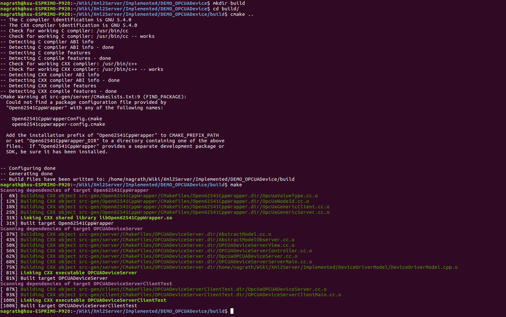
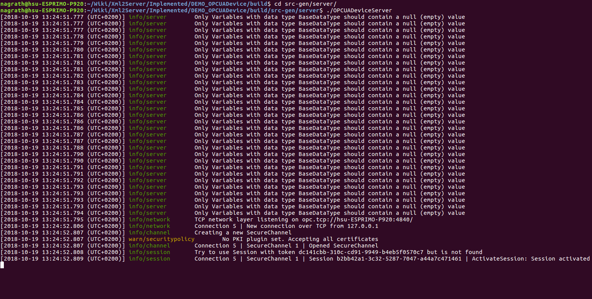

# Making a simple server using Open62541 XML Compiler

An OPC-UA information model can be encoded according to OPC-UA nodeset schema (Link: <https://opcfoundation.org/UA/schemas/1.04/>). When writing a new OPC-UA server, its information model can be encoded in XML format manually or by using a modeling tool. Once encoded, the XML file containing the server's nodeset schema can be compiled using SeRoNet's XML Nodeset Compiler to generate cpp code for a model-view-controller (MVC). By attaching an appropriate device driver model and by implementing the device controller, the OPC-UA server can be completed. Following is an example explaining the MVC architecture for a conveyor belt device running an OPC-UA server.


Following is an information model for a server. 
```
OPCUADeviceServer
|--isReady        	(Boolean    ReadOnly)
|--pumpWater        	(Method	    Input:Time in seconds Output:result code)
|--start_Ventilator     (Method     Input:VentilatorID    Output:result code)
|--start_Ventilator     (Method     Input:VentilatorID    Output:result code)
|--LED_RED        	(Boolean    Read/Write)
|--LED_YELLOW       	(Boolean    Read/Write)
|--LED_GREEN        	(Boolean    Read/Write)
```
Following is a step-by-step walkthrough for generating an OPC-UA server from a given information model. 

## Step 1: Encoding server nodeset

The information model for OPCUADeviceServer can be encoded according to OPC-UA nodeset schema to generate the following XML file.
```
OPCUADeviceServer.xml
```

<details><summary>View File Content</summary>
<p>
	
```XML
<UANodeSet xmlns:xsi="http://www.w3.org/2001/XMLSchema-instance"
           xmlns:uax="http://opcfoundation.org/UA/2008/02/Types.xsd"
           xmlns="http://opcfoundation.org/UA/2011/03/UANodeSet.xsd"
           xmlns:s1="http://yourorganisation.org/example_nodeset/"
           xmlns:xsd="http://www.w3.org/2001/XMLSchema">
    <NamespaceUris>
	<Uri>http://http://opcfoundation.org/UA/SeRoNetOPCUADeviceServer/</Uri>
    </NamespaceUris>
    <Aliases>
        <Alias Alias="Boolean">i=1</Alias>
        <Alias Alias="UInt32">i=7</Alias>
        <Alias Alias="String">i=12</Alias>
        <Alias Alias="HasModellingRule">i=37</Alias>
        <Alias Alias="HasTypeDefinition">i=40</Alias>
        <Alias Alias="HasSubtype">i=45</Alias>
        <Alias Alias="HasProperty">i=46</Alias>
        <Alias Alias="HasComponent">i=47</Alias>
        <Alias Alias="Argument">i=296</Alias>
    </Aliases>
    <Extensions>
        <Extension>
            <ModelInfo Tool="UaModeler" Hash="Zs8w1AQI71W8P/GOk3k/xQ=="
                       Version="1.3.4"/>
        </Extension>
    </Extensions>
    <UAReferenceType NodeId="ns=1;i=4001" BrowseName="1:providesInputTo">
        <DisplayName>providesInputTo</DisplayName>
        <References>
            <Reference ReferenceType="HasSubtype" IsForward="false">
                i=33
            </Reference>
        </References>
        <InverseName Locale="en-US">inputProcidedBy</InverseName>
    </UAReferenceType>
    <UAObjectType IsAbstract="true" NodeId="ns=1;i=1001"
                  BrowseName="1:OPCUADeviceServer">
        <DisplayName>OPCUADeviceServer</DisplayName>
        <References>
            <Reference ReferenceType="HasSubtype" IsForward="false">
                i=58
            </Reference>
            <Reference ReferenceType="HasComponent">ns=1;i=6001</Reference>
            <Reference ReferenceType="HasComponent">ns=1;i=7001</Reference>
            <Reference ReferenceType="HasComponent">ns=1;i=8001</Reference>
            <Reference ReferenceType="HasComponent">ns=1;i=8101</Reference>
            <Reference ReferenceType="HasComponent">ns=1;i=9001</Reference>
            <Reference ReferenceType="HasComponent">ns=1;i=9002</Reference>
            <Reference ReferenceType="HasComponent">ns=1;i=9003</Reference>
        </References>
    </UAObjectType>
    <UAVariable DataType="Boolean" ParentNodeId="ns=1;i=1001"
                NodeId="ns=1;i=6001" BrowseName="1:isReady"
                UserAccessLevel="1" AccessLevel="1">
        <DisplayName>isReady</DisplayName>
        <References>
            <Reference ReferenceType="HasTypeDefinition">i=63</Reference>
            <Reference ReferenceType="HasModellingRule">i=78</Reference>
            <Reference ReferenceType="HasComponent" IsForward="false">
                ns=1;i=1001
            </Reference>
        </References>
    </UAVariable>

    <UAMethod ParentNodeId="ns=1;i=1001" NodeId="ns=1;i=7001"
              BrowseName="1:pumpWater">
        <DisplayName>pumpWater</DisplayName>
        <References>
            <Reference ReferenceType="HasModellingRule">i=78</Reference>
            <Reference ReferenceType="HasProperty">ns=1;i=7002</Reference>
            <Reference ReferenceType="HasProperty">ns=1;i=7003</Reference>
            <Reference ReferenceType="HasComponent" IsForward="false">
                ns=1;i=1001
            </Reference>
        </References>
    </UAMethod>
    <UAVariable DataType="Argument" ParentNodeId="ns=1;i=7001" ValueRank="1"
                NodeId="ns=1;i=7002" ArrayDimensions="1"
                BrowseName="OutputArguments">
        <DisplayName>OutputArguments</DisplayName>
        <References>
            <Reference ReferenceType="HasModellingRule">i=78</Reference>
            <Reference ReferenceType="HasProperty"
                       IsForward="false">ns=1;i=7001</Reference>
            <Reference ReferenceType="HasTypeDefinition">i=68</Reference>
        </References>
        <Value>
            <ListOfExtensionObject>
                <ExtensionObject>
                    <TypeId>
                        <Identifier>i=297</Identifier>
                    </TypeId>
                    <Body>
                        <Argument>
                            <Name>result</Name>
                            <DataType>
                                <Identifier>i=12</Identifier>
                            </DataType>
                            <ValueRank>-1</ValueRank>
                            <ArrayDimensions></ArrayDimensions>
                            <Description/>
                        </Argument>
                    </Body>
                </ExtensionObject>
            </ListOfExtensionObject>
        </Value>
    </UAVariable>
    <UAVariable DataType="Argument" ParentNodeId="ns=1;i=7001" ValueRank="1"
                NodeId="ns=1;i=7003" ArrayDimensions="1"
                BrowseName="InputArguments">
        <DisplayName>InputArguments</DisplayName>
        <References>
            <Reference ReferenceType="HasModellingRule">i=78</Reference>
            <Reference ReferenceType="HasProperty"
                       IsForward="false">ns=1;i=7001</Reference>
            <Reference ReferenceType="HasTypeDefinition">i=68</Reference>
        </References>
        <Value>
            <ListOfExtensionObject>
                <ExtensionObject>
                    <TypeId>
                        <Identifier>i=297</Identifier>
                    </TypeId>
                    <Body>
                        <Argument>
                            <Name>ForTimeSeconds</Name>
                            <DataType>
                                <Identifier>i=6</Identifier>
                            </DataType>
                            <ValueRank>-1</ValueRank>
                            <ArrayDimensions></ArrayDimensions>
                            <Description/>
                        </Argument>
                    </Body>
                </ExtensionObject>
            </ListOfExtensionObject>
        </Value>
    </UAVariable>


    <UAMethod ParentNodeId="ns=1;i=1001" NodeId="ns=1;i=8001"
              BrowseName="1:start_Ventilator">
        <DisplayName>start_Ventilator</DisplayName>
        <References>
            <Reference ReferenceType="HasModellingRule">i=78</Reference>
            <Reference ReferenceType="HasProperty">ns=1;i=8002</Reference>
            <Reference ReferenceType="HasProperty">ns=1;i=8003</Reference>
            <Reference ReferenceType="HasComponent"
                       IsForward="false">ns=1;i=1001</Reference>
        </References>
    </UAMethod>
    <UAVariable DataType="Argument" ParentNodeId="ns=1;i=8001" ValueRank="1"
                NodeId="ns=1;i=8002" ArrayDimensions="1"
                BrowseName="OutputArguments">
        <DisplayName>OutputArguments</DisplayName>
        <References>
            <Reference ReferenceType="HasModellingRule">i=78</Reference>
            <Reference ReferenceType="HasProperty"
                       IsForward="false">ns=1;i=8001</Reference>
            <Reference ReferenceType="HasTypeDefinition">i=68</Reference>
        </References>
        <Value>
            <ListOfExtensionObject>
                <ExtensionObject>
                    <TypeId>
                        <Identifier>i=297</Identifier>
                    </TypeId>
                    <Body>
                        <Argument>
                            <Name>result</Name>
                            <DataType>
                                <Identifier>i=12</Identifier>
                            </DataType>
                            <ValueRank>-1</ValueRank>
                            <ArrayDimensions></ArrayDimensions>
                            <Description/>
                        </Argument>
                    </Body>
                </ExtensionObject>
            </ListOfExtensionObject>
        </Value>
    </UAVariable>
    <UAVariable DataType="Argument" ParentNodeId="ns=1;i=8001" ValueRank="1"
                NodeId="ns=1;i=8003" ArrayDimensions="1"
                BrowseName="InputArguments">
        <DisplayName>InputArguments</DisplayName>
        <References>
            <Reference ReferenceType="HasModellingRule">i=78</Reference>
            <Reference ReferenceType="HasProperty"
                       IsForward="false">ns=1;i=8001</Reference>
            <Reference ReferenceType="HasTypeDefinition">i=68</Reference>
        </References>
        <Value>
            <ListOfExtensionObject>
                <ExtensionObject>
                    <TypeId>
                        <Identifier>i=297</Identifier>
                    </TypeId>
                    <Body>
                        <Argument>
                            <Name>VentilatorID</Name>
                            <DataType>
                                <Identifier>i=6</Identifier>
                            </DataType>
                            <ValueRank>-1</ValueRank>
                            <ArrayDimensions></ArrayDimensions>
                            <Description/>
                        </Argument>
                    </Body>
                </ExtensionObject>
            </ListOfExtensionObject>
        </Value>
    </UAVariable>
    <UAMethod ParentNodeId="ns=1;i=1001" NodeId="ns=1;i=8101"
              BrowseName="1:stop_Ventilator">
        <DisplayName>stop_Ventilator</DisplayName>
        <References>
            <Reference ReferenceType="HasModellingRule">i=78</Reference>
            <Reference ReferenceType="HasProperty">ns=1;i=8102</Reference>
            <!-- <Reference ReferenceType="HasProperty">ns=1;i=8103</Reference> -->
            <Reference ReferenceType="HasComponent"
                       IsForward="false">ns=1;i=1001</Reference>
        </References>
    </UAMethod>
    <UAVariable DataType="Argument" ParentNodeId="ns=1;i=8101" ValueRank="1"
                NodeId="ns=1;i=8102" ArrayDimensions="1"
                BrowseName="OutputArguments">
        <DisplayName>OutputArguments</DisplayName>
        <References>
            <Reference ReferenceType="HasModellingRule">i=78</Reference>
            <Reference ReferenceType="HasProperty"
                       IsForward="false">ns=1;i=8101</Reference>
            <Reference ReferenceType="HasTypeDefinition">i=68</Reference>
        </References>
        <Value>
            <ListOfExtensionObject>
                <ExtensionObject>
                    <TypeId>
                        <Identifier>i=297</Identifier>
                    </TypeId>
                    <Body>
                        <Argument>
                            <Name>result</Name>
                            <DataType>
                                <Identifier>i=12</Identifier>
                            </DataType>
                            <ValueRank>-1</ValueRank>
                            <ArrayDimensions></ArrayDimensions>
                            <Description/>
                        </Argument>
                    </Body>
                </ExtensionObject>
            </ListOfExtensionObject>
        </Value>
    </UAVariable>    	
    <UAVariable DataType="Argument" ParentNodeId="ns=1;i=8101" ValueRank="1"
                NodeId="ns=1;i=8103" ArrayDimensions="1"
                BrowseName="InputArguments">
        <DisplayName>InputArguments</DisplayName>
        <References>
            <Reference ReferenceType="HasModellingRule">i=78</Reference>
            <Reference ReferenceType="HasProperty"
                       IsForward="false">ns=1;i=8101</Reference>
            <Reference ReferenceType="HasTypeDefinition">i=68</Reference>
        </References>
        <Value>
            <ListOfExtensionObject>
                <ExtensionObject>
                    <TypeId>
                        <Identifier>i=297</Identifier>
                    </TypeId>
                    <Body>
                        <Argument>
                            <Name>VentilatorID</Name>
                            <DataType>
                                <Identifier>i=6</Identifier>
                            </DataType>
                            <ValueRank>-1</ValueRank>
                            <ArrayDimensions></ArrayDimensions>
                            <Description/>
                        </Argument>
                    </Body>
                </ExtensionObject>
            </ListOfExtensionObject>
        </Value>
    </UAVariable>    
    <UAVariable DataType="Boolean" ParentNodeId="ns=1;i=1001"
                NodeId="ns=1;i=9001" BrowseName="LED_RED" UserAccessLevel="3"
                AccessLevel="3">
        <DisplayName>LED_RED</DisplayName>
        <References>
            <Reference ReferenceType="HasTypeDefinition">i=63</Reference>
            <Reference ReferenceType="HasModellingRule">i=78</Reference>
            <Reference ReferenceType="HasComponent" IsForward="false">
                ns=1;i=1001
            </Reference>
        </References>
    </UAVariable>
    <UAVariable DataType="Boolean" ParentNodeId="ns=1;i=1001"
                NodeId="ns=1;i=9002" BrowseName="LED_YELLOW" UserAccessLevel="3"
                AccessLevel="3">
        <DisplayName>LED_YELLOW</DisplayName>
        <References>
            <Reference ReferenceType="HasTypeDefinition">i=63</Reference>
            <Reference ReferenceType="HasModellingRule">i=78</Reference>
            <Reference ReferenceType="HasComponent" IsForward="false">
                ns=1;i=1001
            </Reference>
        </References>
    </UAVariable>
    <UAVariable DataType="Boolean" ParentNodeId="ns=1;i=1001"
                NodeId="ns=1;i=9003" BrowseName="LED_GREEN" UserAccessLevel="3"
                AccessLevel="3">
        <DisplayName>LED_GREEN</DisplayName>
        <References>
            <Reference ReferenceType="HasTypeDefinition">i=63</Reference>
            <Reference ReferenceType="HasModellingRule">i=78</Reference>
            <Reference ReferenceType="HasComponent" IsForward="false">
                ns=1;i=1001
            </Reference>
        </References>
    </UAVariable>
</UANodeSet>

```
</p>
</details>

## Step 2: Compiling server nodeset XML to generate cpp gen-code
```
XML nodeset file  : OPCUADeviceServer.xml
Compiler JAR file : Open62541XmlCompiler.jar
Compiler Arguments: <XML-File> ( [ALL] | ([SERVER] [CLIENT] [MVC]) )

```
The following command compiles the server nodeset XML file to generate cpp gen-code
```sh
java -jar Open62541XmlCompiler.jar OPCUADeviceServer.xml ALL
```


```
Compilation output:
output_OPCUADeviceServer
├── CMakeLists.txt				
└── src-gen
    ├── client
    │   ├── CMakeLists.txt
    │   ├── OPCUADeviceServerClientMain.cc
    │   ├── OpcUaOPCUADeviceServer.cc
    │   └── OpcUaOPCUADeviceServer.hh
    ├── CMakeLists.txt
    ├── OPCUADeviceServerInterface.hh
    ├── Open62541CppWrapper
    │   ├── CMakeLists.txt
    │   ├── OpcUaGenericClient.cc
    │   ├── OpcUaGenericClient.hh
    │   ├── OpcUaGenericServer.cc
    │   ├── OpcUaGenericServer.hh
    │   ├── OpcUaNodeId.cc
    │   ├── OpcUaNodeId.hh
    │   ├── OpcUaStatusCode.hh
    │   ├── OpcUaValueType.cc
    │   ├── OpcUaValueType.hh
    │   └── Open62541CppWrapperConfig.cmake.in
    └── server
        ├── AbstractModel.cc
        ├── AbstractModel.hh
        ├── AbstractModelObserver.cc
        ├── AbstractModelObserver.hh
        ├── CMakeLists.txt			// FIXME : add path to device driver models
        ├── OPCUADeviceServerController.cc	// FIXME : implement all getter setter and call methods
        ├── OPCUADeviceServerController.hh
        ├── OPCUADeviceServerServerMain.cc	// FIXME : use your specific model instead of the AbstractModel
        ├── OPCUADeviceServerView.cc		// FIXME1: use your specific model instead of the AbstractModel
    						// FIXME2: implement OPCUADeviceServerView::update() method
        ├── OPCUADeviceServerView.hh		// FIXME : use your specific model instead of the AbstractModel
        ├── OpcUaOPCUADeviceServer.cc		// OPTIONAL: Modify HTMLMirror method to include graphic elements
        └── OpcUaOPCUADeviceServer.hh
	
```
## Step 3: Device driver models
A device driver model is a derived class that publically inherits the "AbstractModel" class and implements methods to drive the physical device. For our example server, we have the following device driver model.
```
DeviceDriverModel.h
```
<details><summary>View File Content</summary>
<p>
	
```c++
#ifndef DeviceDRIVERMODEL_H_
#define DeviceDRIVERMODEL_H_

#include "AbstractModel.hh"

namespace Smart {

class DeviceDriverModel : public AbstractModel {

public:
	/// default constructor
	DeviceDriverModel(const bool &startInternalThread=false);
	/// default destructor
	virtual ~DeviceDriverModel();

	/// start the internally used thread
	void startThread();
	/// stop the internally used thread
	void stopThread(const bool &waitTillStopped=true);

	bool isReady;
	bool getISREADY();

	bool PumpON();
	bool PumpOFF();

	bool VentilatorON(const uint8_t &id);
	bool VentilatorOFF(const uint8_t &id);

	bool getLED(const uint8_t &n); // n:0/1/2
	bool setLED(const uint8_t &n, const bool &value); // n:0/1/2
};

} /* namespace Smart */

#endif /* DeviceDRIVERMODEL_H_ */
```
</p>
</details>

## Step 4: Configuring generate code for a particular device driver model
### Adding path to device driver model in CMakeList.txt
<details><summary>View Changes</summary>
<p>
	
```
CMAKE_MINIMUM_REQUIRED(VERSION 3.0)

PROJECT(OPCUADeviceServer)

# find Open62541CppWrapper as the main dependency
FIND_PACKAGE(open62541 PATHS /usr/local/lib/cmake)

# FIND_PACKAGE(Open62541CppWrapper)
FIND_PACKAGE(Open62541CppWrapper PATHS ${PROJECT_SOURCE_DIR}/../Open62541CppWrapper)

# setup default include directoy
INCLUDE_DIRECTORIES(
	${PROJECT_SOURCE_DIR}
	${PROJECT_SOURCE_DIR}/..
	Path/To/DeviceDriverModel
)

# setup server source files
SET(SERVER_SRCS
	${PROJECT_SOURCE_DIR}/AbstractModel.cc
	${PROJECT_SOURCE_DIR}/AbstractModelObserver.cc
	${PROJECT_SOURCE_DIR}/OPCUADeviceServerView.cc
	${PROJECT_SOURCE_DIR}/OPCUADeviceServerController.cc
	${PROJECT_SOURCE_DIR}/OpcUaOPCUADeviceServer.cc
	${PROJECT_SOURCE_DIR}/OPCUADeviceServerServerMain.cc
	Path/To/DeviceDriverModel/DeviceDriverModel.cpp
)

# create server test executable
ADD_EXECUTABLE(${PROJECT_NAME} ${SERVER_SRCS})
TARGET_LINK_LIBRARIES(${PROJECT_NAME} Open62541CppWrapper rt crypt pthread)
SET_TARGET_PROPERTIES(${PROJECT_NAME} PROPERTIES
    CXX_STANDARD 11
)
#TARGET_COMPILE_DEFINITIONS(${PROJECT_NAME} PUBLIC HAS_OPCUA)

```
	
</p>
</details>	

### Configuring generate code

The following files require to be configured for a device-specific model instead of the AbstractModel.

```
OPCUADeviceServerServerMain.cc
OPCUADeviceServerView.hh	
OPCUADeviceServerView.cc	
```
##### OPCUADeviceServerServerMain.cc


##### OPCUADeviceServerView.hh	


##### OPCUADeviceServerView.cc	


## Step 5: Writing the device controller code
The compiler generated file "OPCUADeviceServerController.cc" contains yet to be implemented getter methods for all server nodes, setter methods for nodes with write access and caller methods corresponding to all server methods. These getter, setter and caller methods require to be implemented as the device controller code. To actualize these controllers, the device driver model can be accessed using "view->getModel()". 

Following is the device controller code for our example server.

<details><summary>View File</summary>
<p>

```c++
//--------------------------------------------------------------------------
// Code generated by the SmartSoft MDSD Toolchain
// The SmartSoft Toolchain has been developed by:
//  
// Service Robotics Research Center
// University of Applied Sciences Ulm
// Prittwitzstr. 10
// 89075 Ulm (Germany)
//
// Information about the SmartSoft MDSD Toolchain is available at:
// www.servicerobotik-ulm.de
//
// Please do not modify this file. It will be re-generated
// running the code generator.
//--------------------------------------------------------------------------

#include "OPCUADeviceServerController.hh"
#include <unistd.h>

namespace Smart {

OPCUADeviceServerController::OPCUADeviceServerController(OPCUADeviceServerView *view)
:	AbstractModelObserver()
,	server(this)
,	view(view)
{
	if(view != 0) {
		view->getModel()->attach(this);
	}
}

OPCUADeviceServerController::~OPCUADeviceServerController()
{  }

void OPCUADeviceServerController::update()
{
	// Nothing to be done for this example
}

//Getter methods for all OPCUA Entity nodes.		
bool OPCUADeviceServerController::getIsReady() const
{
	return view->getModel()->getISREADY();
}
bool OPCUADeviceServerController::getLED_RED() const
{
	return view->getModel()->getLED(1);
}
bool OPCUADeviceServerController::getLED_YELLOW() const
{
	return view->getModel()->getLED(2);
}
bool OPCUADeviceServerController::getLED_GREEN() const
{
	return view->getModel()->getLED(3);
}
//Setter methods for OPCUA Entity nodes with write access.
bool OPCUADeviceServerController::setLED_RED(const bool &value)
{
	return view->getModel()->setLED(1, value);
}
bool OPCUADeviceServerController::setLED_YELLOW(const bool &value)
{
	return view->getModel()->setLED(2, value);
}
bool OPCUADeviceServerController::setLED_GREEN(const bool &value)
{
	return view->getModel()->setLED(3, value);
}

//Access methods for OPCUA Method nodes.
bool OPCUADeviceServerController::callPumpWater(const int &ForTimeSeconds,std::string &Result)
{
	bool status1 = view->getModel()->PumpON();
	if(status1)
	{
		sleep(ForTimeSeconds);
		bool status2 = view->getModel()->PumpOFF();
		if(status2)
		{
			Result = "SUCCESS";
			return true;
		}
		else
		{
			Result = "FAIL";			
			return false;
		}
	
	}
	else
	{
		Result = "FAIL";
	}
	return false;
}
bool OPCUADeviceServerController::callStart_Ventilator(const int &VentilatorID,std::string &Result)
{
	bool status = view->getModel()->VentilatorON(VentilatorID);
	if(status)
	{
		Result = "SUCCESS";
		return true;
	}
	else
	{
		Result = "FAIL";
	}
	return false;
}
bool OPCUADeviceServerController::callStop_Ventilator(const int &VentilatorID,std::string &Result)
{
	bool status = view->getModel()->VentilatorOFF(VentilatorID);
	if(status)
	{
		Result = "SUCCESS";
		return true;
	}
	else
	{
		Result = "FAIL";
	}
	return false;

}

int OPCUADeviceServerController::run()
{
	// this call executes the OPCUA server (until it is killed)
	return server.run();
}

} /* namespace Smart */

```

</p>
</details>

## Step 6: Compiling and running the server

```sh
DEMO_OPCUADevice$ mkdir build
DEMO_OPCUADevice$ cd build
DEMO_OPCUADevice/build$ cmake ..
DEMO_OPCUADevice/build$ make
DEMO_OPCUADevice/build$ cd src-gen/server/
DEMO_OPCUADevice/build/src-gen/server$ ./OPCUADeviceServer
```




## Step 7: Observing server behaviour using any OPC-UA client and server HTML View
